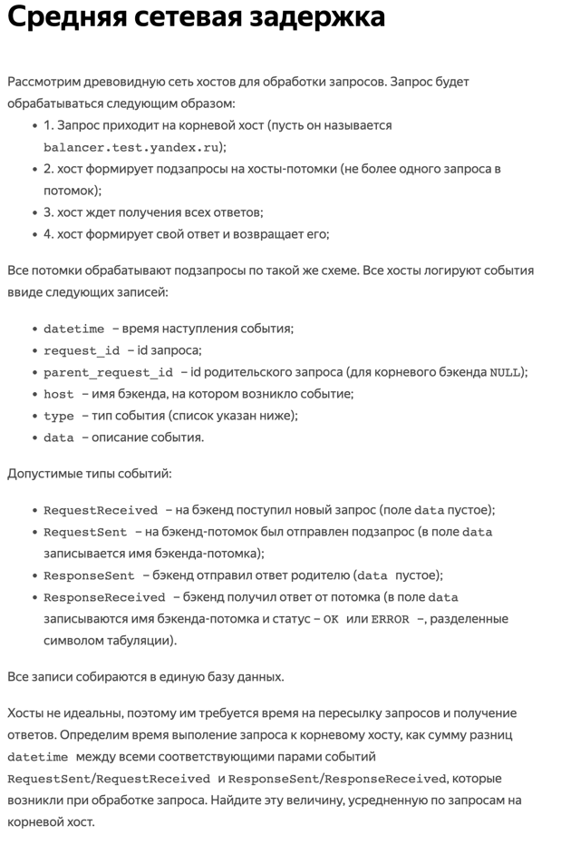
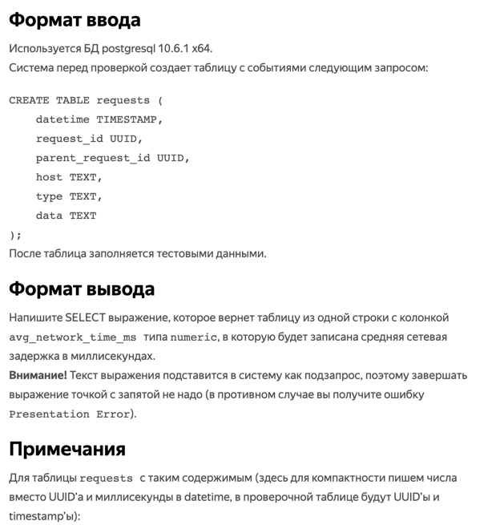
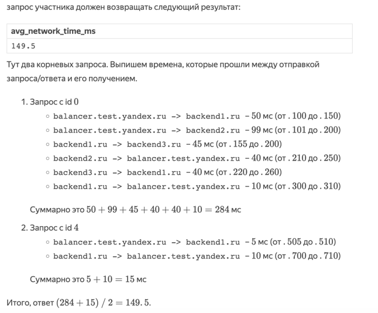

<h1 align="center">Задача 2. Средняя сетевая задержка</h1>

<table cellpadding="0" cellspacing="0" rules="groups" style="border-left: solid black 0.4pt; border-right: solid black 0.4pt; margin-left: auto; margin-right: auto;"><colgroup> <col> </colgroup> <colgroup> <col> </colgroup> <colgroup> <col> </colgroup> <colgroup> <col> </colgroup> <colgroup> <col> </colgroup> <colgroup> <col> </colgroup>
<tbody>
<tr style="vertical-align: baseline;">
<td style="padding-left: 5pt; padding-right: 5pt; text-align: left; white-space: nowrap;">datetime</td>
<td style="padding-left: 5pt; padding-right: 5pt; text-align: left; white-space: nowrap;">request_id</td>
<td style="padding-left: 5pt; padding-right: 5pt; text-align: left; white-space: nowrap;">parent_request_id</td>
<td style="padding-left: 5pt; padding-right: 5pt; text-align: left; white-space: nowrap;">host </td>
<td style="padding-left: 5pt; padding-right: 5pt; text-align: left; white-space: nowrap;">type </td>
<td style="padding-left: 5pt; padding-right: 5pt; text-align: left; white-space: nowrap;">data </td>
</tr>
<tr style="vertical-align: baseline;">
<td style="padding-left: 5pt; padding-right: 5pt; text-align: left; white-space: nowrap;">.000 </td>
<td style="padding-left: 5pt; padding-right: 5pt; text-align: left; white-space: nowrap;">0 </td>
<td style="padding-left: 5pt; padding-right: 5pt; text-align: left; white-space: nowrap;">NULL </td>
<td style="padding-left: 5pt; padding-right: 5pt; text-align: left; white-space: nowrap;">balancer.test.yandex.ru</td>
<td style="padding-left: 5pt; padding-right: 5pt; text-align: left; white-space: nowrap;">RequestReceived </td>
<td style="padding-left: 5pt; padding-right: 5pt; text-align: left; white-space: nowrap;"></td>
</tr>
<tr style="vertical-align: baseline;">
<td style="padding-left: 5pt; padding-right: 5pt; text-align: left; white-space: nowrap;">.100 </td>
<td style="padding-left: 5pt; padding-right: 5pt; text-align: left; white-space: nowrap;">0 </td>
<td style="padding-left: 5pt; padding-right: 5pt; text-align: left; white-space: nowrap;">NULL </td>
<td style="padding-left: 5pt; padding-right: 5pt; text-align: left; white-space: nowrap;">balancer.test.yandex.ru</td>
<td style="padding-left: 5pt; padding-right: 5pt; text-align: left; white-space: nowrap;">RequestSent </td>
<td style="padding-left: 5pt; padding-right: 5pt; text-align: left; white-space: nowrap;">backend1.ru </td>
</tr>
<tr style="vertical-align: baseline;">
<td style="padding-left: 5pt; padding-right: 5pt; text-align: left; white-space: nowrap;">.101 </td>
<td style="padding-left: 5pt; padding-right: 5pt; text-align: left; white-space: nowrap;">0 </td>
<td style="padding-left: 5pt; padding-right: 5pt; text-align: left; white-space: nowrap;">NULL </td>
<td style="padding-left: 5pt; padding-right: 5pt; text-align: left; white-space: nowrap;">balancer.test.yandex.ru</td>
<td style="padding-left: 5pt; padding-right: 5pt; text-align: left; white-space: nowrap;">RequestSent </td>
<td style="padding-left: 5pt; padding-right: 5pt; text-align: left; white-space: nowrap;">backend2.ru </td>
</tr>
<tr style="vertical-align: baseline;">
<td style="padding-left: 5pt; padding-right: 5pt; text-align: left; white-space: nowrap;">.150 </td>
<td style="padding-left: 5pt; padding-right: 5pt; text-align: left; white-space: nowrap;">1 </td>
<td style="padding-left: 5pt; padding-right: 5pt; text-align: left; white-space: nowrap;">0 </td>
<td style="padding-left: 5pt; padding-right: 5pt; text-align: left; white-space: nowrap;">backend1.ru </td>
<td style="padding-left: 5pt; padding-right: 5pt; text-align: left; white-space: nowrap;">RequestReceived </td>
<td style="padding-left: 5pt; padding-right: 5pt; text-align: left; white-space: nowrap;"></td>
</tr>
<tr style="vertical-align: baseline;">
<td style="padding-left: 5pt; padding-right: 5pt; text-align: left; white-space: nowrap;">.200 </td>
<td style="padding-left: 5pt; padding-right: 5pt; text-align: left; white-space: nowrap;">2 </td>
<td style="padding-left: 5pt; padding-right: 5pt; text-align: left; white-space: nowrap;">0 </td>
<td style="padding-left: 5pt; padding-right: 5pt; text-align: left; white-space: nowrap;">backend2.ru </td>
<td style="padding-left: 5pt; padding-right: 5pt; text-align: left; white-space: nowrap;">RequestReceived </td>
<td style="padding-left: 5pt; padding-right: 5pt; text-align: left; white-space: nowrap;"></td>
</tr>
<tr style="vertical-align: baseline;">
<td style="padding-left: 5pt; padding-right: 5pt; text-align: left; white-space: nowrap;">.155 </td>
<td style="padding-left: 5pt; padding-right: 5pt; text-align: left; white-space: nowrap;">1 </td>
<td style="padding-left: 5pt; padding-right: 5pt; text-align: left; white-space: nowrap;">0 </td>
<td style="padding-left: 5pt; padding-right: 5pt; text-align: left; white-space: nowrap;">backend1.ru </td>
<td style="padding-left: 5pt; padding-right: 5pt; text-align: left; white-space: nowrap;">RequestSent </td>
<td style="padding-left: 5pt; padding-right: 5pt; text-align: left; white-space: nowrap;">backend3.ru </td>
</tr>
<tr style="vertical-align: baseline;">
<td style="padding-left: 5pt; padding-right: 5pt; text-align: left; white-space: nowrap;">.210 </td>
<td style="padding-left: 5pt; padding-right: 5pt; text-align: left; white-space: nowrap;">2 </td>
<td style="padding-left: 5pt; padding-right: 5pt; text-align: left; white-space: nowrap;">0 </td>
<td style="padding-left: 5pt; padding-right: 5pt; text-align: left; white-space: nowrap;">backend2.ru </td>
<td style="padding-left: 5pt; padding-right: 5pt; text-align: left; white-space: nowrap;">ResponseSent </td>
<td style="padding-left: 5pt; padding-right: 5pt; text-align: left; white-space: nowrap;"></td>
</tr>
<tr style="vertical-align: baseline;">
<td style="padding-left: 5pt; padding-right: 5pt; text-align: left; white-space: nowrap;">.200 </td>
<td style="padding-left: 5pt; padding-right: 5pt; text-align: left; white-space: nowrap;">3 </td>
<td style="padding-left: 5pt; padding-right: 5pt; text-align: left; white-space: nowrap;">1 </td>
<td style="padding-left: 5pt; padding-right: 5pt; text-align: left; white-space: nowrap;">backend3.ru </td>
<td style="padding-left: 5pt; padding-right: 5pt; text-align: left; white-space: nowrap;">RequestReceived </td>
<td style="padding-left: 5pt; padding-right: 5pt; text-align: left; white-space: nowrap;"></td>
</tr>
<tr style="vertical-align: baseline;">
<td style="padding-left: 5pt; padding-right: 5pt; text-align: left; white-space: nowrap;">.220 </td>
<td style="padding-left: 5pt; padding-right: 5pt; text-align: left; white-space: nowrap;">3 </td>
<td style="padding-left: 5pt; padding-right: 5pt; text-align: left; white-space: nowrap;">1 </td>
<td style="padding-left: 5pt; padding-right: 5pt; text-align: left; white-space: nowrap;">backend3.ru </td>
<td style="padding-left: 5pt; padding-right: 5pt; text-align: left; white-space: nowrap;">ResponseSent </td>
<td style="padding-left: 5pt; padding-right: 5pt; text-align: left; white-space: nowrap;"></td>
</tr>
<tr style="vertical-align: baseline;">
<td style="padding-left: 5pt; padding-right: 5pt; text-align: left; white-space: nowrap;">.260 </td>
<td style="padding-left: 5pt; padding-right: 5pt; text-align: left; white-space: nowrap;">1 </td>
<td style="padding-left: 5pt; padding-right: 5pt; text-align: left; white-space: nowrap;">0 </td>
<td style="padding-left: 5pt; padding-right: 5pt; text-align: left; white-space: nowrap;">backend1.ru </td>
<td style="padding-left: 5pt; padding-right: 5pt; text-align: left; white-space: nowrap;">ResponseReceived</td>
<td style="padding-left: 5pt; padding-right: 5pt; text-align: left; white-space: nowrap;">backend3.ru OK </td>
</tr>
<tr style="vertical-align: baseline;">
<td style="padding-left: 5pt; padding-right: 5pt; text-align: left; white-space: nowrap;">.300 </td>
<td style="padding-left: 5pt; padding-right: 5pt; text-align: left; white-space: nowrap;">1 </td>
<td style="padding-left: 5pt; padding-right: 5pt; text-align: left; white-space: nowrap;">0 </td>
<td style="padding-left: 5pt; padding-right: 5pt; text-align: left; white-space: nowrap;">backend1.ru </td>
<td style="padding-left: 5pt; padding-right: 5pt; text-align: left; white-space: nowrap;">ResponseSent </td>
<td style="padding-left: 5pt; padding-right: 5pt; text-align: left; white-space: nowrap;"></td>
</tr>
<tr style="vertical-align: baseline;">
<td style="padding-left: 5pt; padding-right: 5pt; text-align: left; white-space: nowrap;">.310 </td>
<td style="padding-left: 5pt; padding-right: 5pt; text-align: left; white-space: nowrap;">0 </td>
<td style="padding-left: 5pt; padding-right: 5pt; text-align: left; white-space: nowrap;">NULL </td>
<td style="padding-left: 5pt; padding-right: 5pt; text-align: left; white-space: nowrap;">balancer.test.yandex.ru</td>
<td style="padding-left: 5pt; padding-right: 5pt; text-align: left; white-space: nowrap;">ResponseReceived</td>
<td style="padding-left: 5pt; padding-right: 5pt; text-align: left; white-space: nowrap;">backend1.ru OK </td>
</tr>
<tr style="vertical-align: baseline;">
<td style="padding-left: 5pt; padding-right: 5pt; text-align: left; white-space: nowrap;">.250 </td>
<td style="padding-left: 5pt; padding-right: 5pt; text-align: left; white-space: nowrap;">0 </td>
<td style="padding-left: 5pt; padding-right: 5pt; text-align: left; white-space: nowrap;">NULL </td>
<td style="padding-left: 5pt; padding-right: 5pt; text-align: left; white-space: nowrap;">balancer.test.yandex.ru</td>
<td style="padding-left: 5pt; padding-right: 5pt; text-align: left; white-space: nowrap;">ResponseReceived</td>
<td style="padding-left: 5pt; padding-right: 5pt; text-align: left; white-space: nowrap;">backend2.ru OK </td>
</tr>
<tr style="vertical-align: baseline;">
<td style="padding-left: 5pt; padding-right: 5pt; text-align: left; white-space: nowrap;">.400 </td>
<td style="padding-left: 5pt; padding-right: 5pt; text-align: left; white-space: nowrap;">0 </td>
<td style="padding-left: 5pt; padding-right: 5pt; text-align: left; white-space: nowrap;">NULL </td>
<td style="padding-left: 5pt; padding-right: 5pt; text-align: left; white-space: nowrap;">balancer.test.yandex.ru</td>
<td style="padding-left: 5pt; padding-right: 5pt; text-align: left; white-space: nowrap;">ResponseSent </td>
<td style="padding-left: 5pt; padding-right: 5pt; text-align: left; white-space: nowrap;"></td>
</tr>
<tr style="vertical-align: baseline;">
<td style="padding-left: 5pt; padding-right: 5pt; text-align: left; white-space: nowrap;">.500 </td>
<td style="padding-left: 5pt; padding-right: 5pt; text-align: left; white-space: nowrap;">4 </td>
<td style="padding-left: 5pt; padding-right: 5pt; text-align: left; white-space: nowrap;">NULL </td>
<td style="padding-left: 5pt; padding-right: 5pt; text-align: left; white-space: nowrap;">balancer.test.yandex.ru</td>
<td style="padding-left: 5pt; padding-right: 5pt; text-align: left; white-space: nowrap;">RequestReceived </td>
<td style="padding-left: 5pt; padding-right: 5pt; text-align: left; white-space: nowrap;"></td>
</tr>
<tr style="vertical-align: baseline;">
<td style="padding-left: 5pt; padding-right: 5pt; text-align: left; white-space: nowrap;">.505 </td>
<td style="padding-left: 5pt; padding-right: 5pt; text-align: left; white-space: nowrap;">4 </td>
<td style="padding-left: 5pt; padding-right: 5pt; text-align: left; white-space: nowrap;">NULL </td>
<td style="padding-left: 5pt; padding-right: 5pt; text-align: left; white-space: nowrap;">balancer.test.yandex.ru</td>
<td style="padding-left: 5pt; padding-right: 5pt; text-align: left; white-space: nowrap;">RequestSent </td>
<td style="padding-left: 5pt; padding-right: 5pt; text-align: left; white-space: nowrap;">backend1.ru </td>
</tr>
<tr style="vertical-align: baseline;">
<td style="padding-left: 5pt; padding-right: 5pt; text-align: left; white-space: nowrap;">.510 </td>
<td style="padding-left: 5pt; padding-right: 5pt; text-align: left; white-space: nowrap;">5 </td>
<td style="padding-left: 5pt; padding-right: 5pt; text-align: left; white-space: nowrap;">4 </td>
<td style="padding-left: 5pt; padding-right: 5pt; text-align: left; white-space: nowrap;">backend1.ru </td>
<td style="padding-left: 5pt; padding-right: 5pt; text-align: left; white-space: nowrap;">RequestReceived </td>
<td style="padding-left: 5pt; padding-right: 5pt; text-align: left; white-space: nowrap;"></td>
</tr>
<tr style="vertical-align: baseline;">
<td style="padding-left: 5pt; padding-right: 5pt; text-align: left; white-space: nowrap;">.700 </td>
<td style="padding-left: 5pt; padding-right: 5pt; text-align: left; white-space: nowrap;">5 </td>
<td style="padding-left: 5pt; padding-right: 5pt; text-align: left; white-space: nowrap;">4 </td>
<td style="padding-left: 5pt; padding-right: 5pt; text-align: left; white-space: nowrap;">backend1.ru </td>
<td style="padding-left: 5pt; padding-right: 5pt; text-align: left; white-space: nowrap;">ResponseSent </td>
<td style="padding-left: 5pt; padding-right: 5pt; text-align: left; white-space: nowrap;"></td>
</tr>
<tr style="vertical-align: baseline;">
<td style="padding-left: 5pt; padding-right: 5pt; text-align: left; white-space: nowrap;">.710 </td>
<td style="padding-left: 5pt; padding-right: 5pt; text-align: left; white-space: nowrap;">4 </td>
<td style="padding-left: 5pt; padding-right: 5pt; text-align: left; white-space: nowrap;">NULL </td>
<td style="padding-left: 5pt; padding-right: 5pt; text-align: left; white-space: nowrap;">balancer.test.yandex.ru</td>
<td style="padding-left: 5pt; padding-right: 5pt; text-align: left; white-space: nowrap;">ResponseReceived</td>
<td style="padding-left: 5pt; padding-right: 5pt; text-align: left; white-space: nowrap;">backend1.ru ERROR</td>
</tr>
<tr style="vertical-align: baseline;">
<td style="padding-left: 5pt; padding-right: 5pt; text-align: left; white-space: nowrap;">.715 </td>
<td style="padding-left: 5pt; padding-right: 5pt; text-align: left; white-space: nowrap;">4 </td>
<td style="padding-left: 5pt; padding-right: 5pt; text-align: left; white-space: nowrap;">NULL </td>
<td style="padding-left: 5pt; padding-right: 5pt; text-align: left; white-space: nowrap;">balancer.test.yandex.ru</td>
<td style="padding-left: 5pt; padding-right: 5pt; text-align: left; white-space: nowrap;">ResponseSent </td>
<td style="padding-left: 5pt; padding-right: 5pt; text-align: left; white-space: nowrap;"></td>
</tr>
</tbody>
</table>

