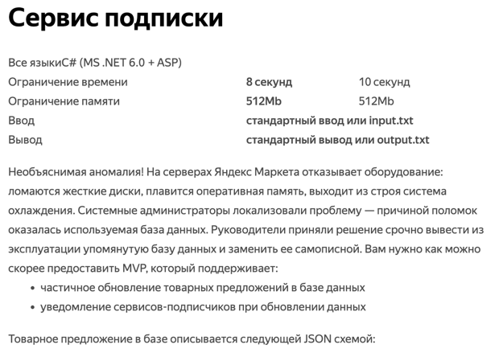
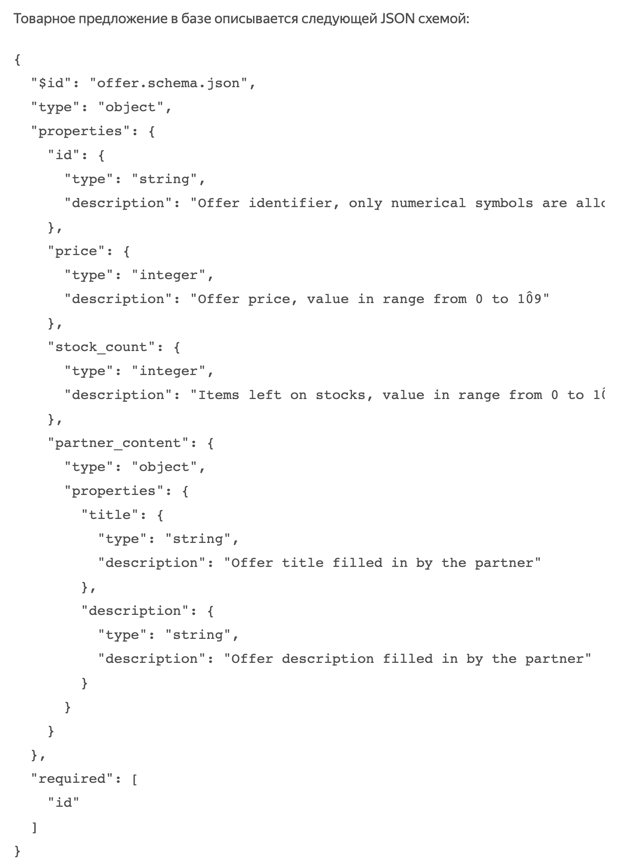
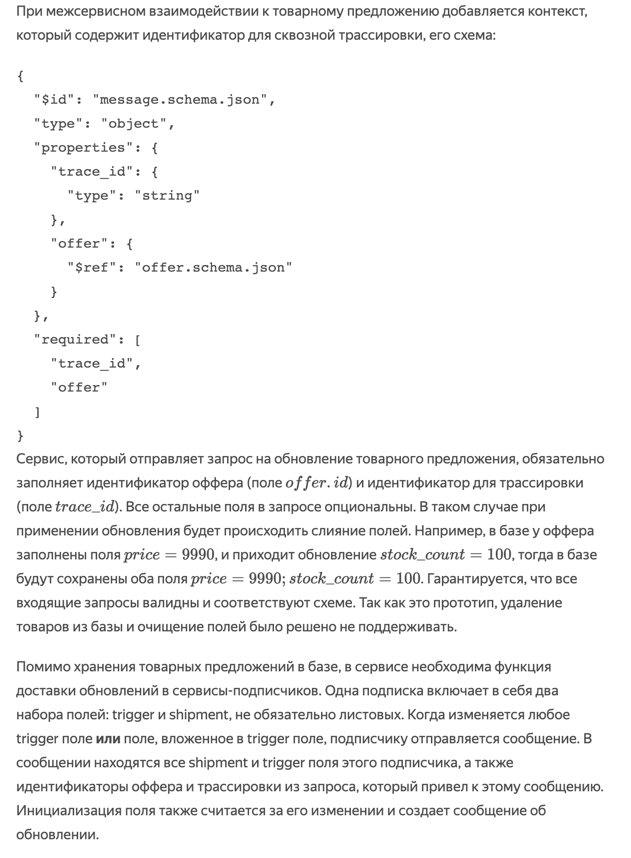
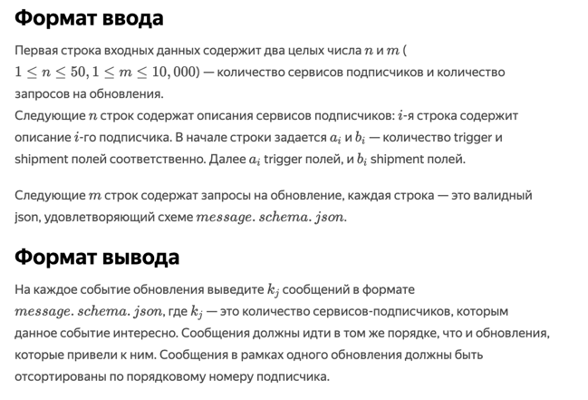
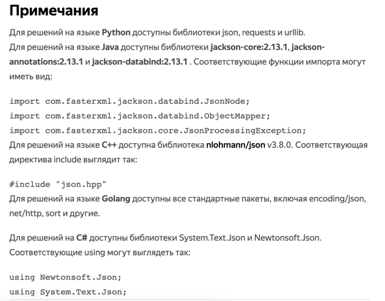

<h1 align="center">Задача 3. Сервис подписки</h1>

## Пример

### Ввод

<pre>2 5
2 0 price stock_count
1 0 partner_content
{"trace_id": "1", "offer": {"id": "1", "price": 9990}}
{"trace_id": "2", "offer": {"id": "1", "stock_count": 100}}
{"trace_id": "3", "offer": {"id": "2", "partner_content": {"title": "Backpack"}}}
{"trace_id": "4", "offer": {"id": "1", "stock_count": 100}}
{"trace_id": "5", "offer": {"id": "2", "partner_content": {"description": "Best backpack ever"}}}
</pre>

### Вывод
<pre>{"trace_id":"1","offer":{"id":"1","price":9990}}
{"trace_id":"2","offer":{"id":"1","price":9990,"stock_count":100}}
{"trace_id":"3","offer":{"id":"2","partner_content":{"title":"Backpack"}}}
{"trace_id":"5","offer":{"id":"2","partner_content":{"description":"Best backpack ever","title":"Backpack"}}}
</pre>